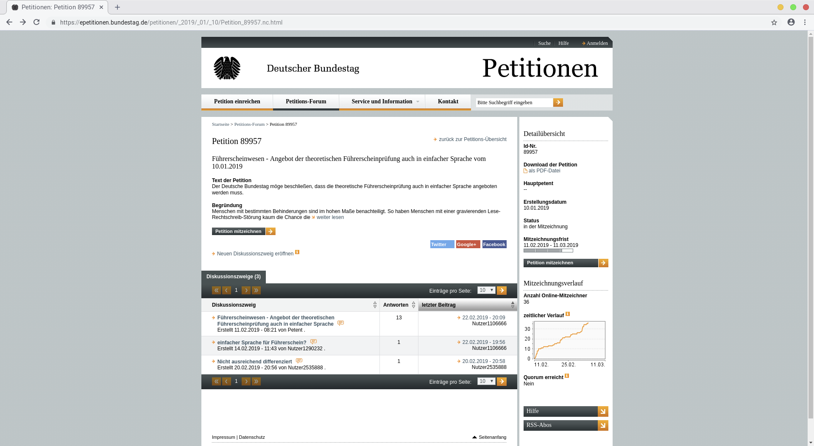
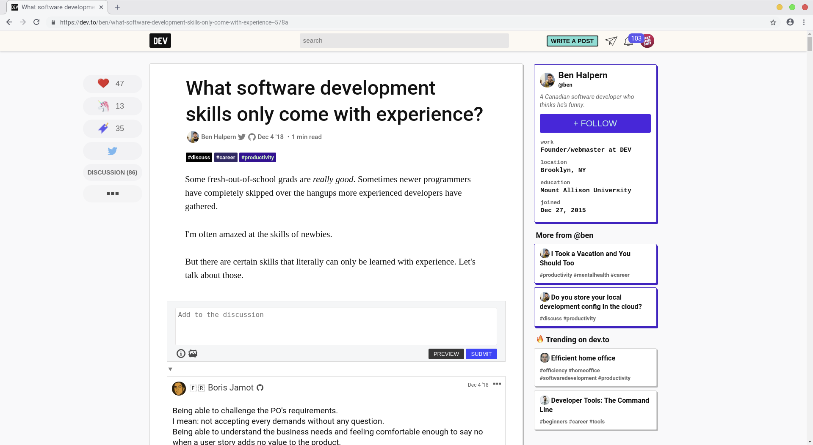
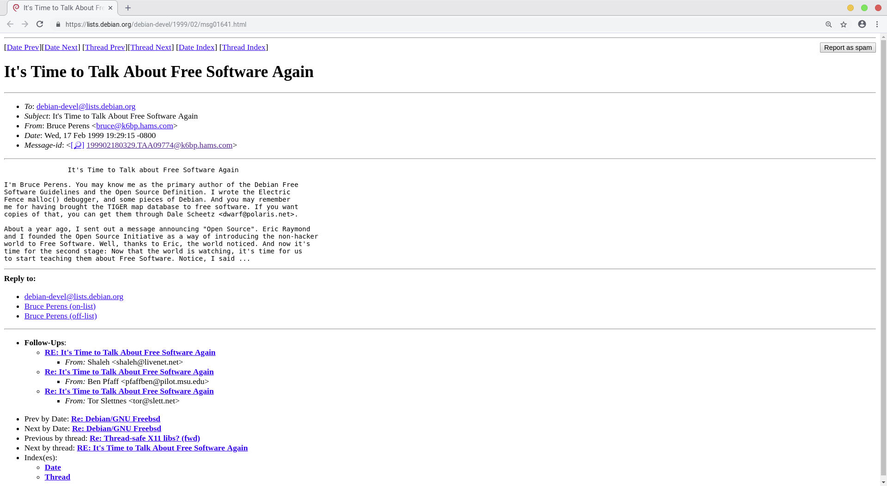

# UUC Session 1

Welcome to the first session regarding User Interfaces (UI) and User Experience (UX).
The main goal is to help you orientate yourself in this hot topic.

# Analysing

A huge part of UI/UX designers is to start with a comprehensive analysis of what is needed, what the status quo looks like and what it lacks.
What are the biggest issues etc.?

## Case Study - German Bundestag Petition

https://epetitionen.bundestag.de/petitionen/_2019/_01/_10/Petition_89957.nc.html

  <small><i>Screenshot of a petition on bundestag.de</i></small>

## Case Study - dev.to Discussion

https://dev.to/ben/what-software-development-skills-only-come-with-experience--578a

  <small><i>Screenshot of a discussion on dev.to</i></small>

## Case Study - Debian Mailinglist

https://lists.debian.org/debian-devel/1999/02/msg01641.html

  <small><i>Screenshot of a thread from the mailinglist on lists.debian.org</i></small>

